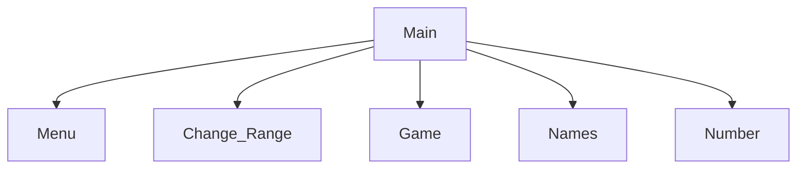

# Number guessing game
Logan, Roman

## Number Guessing game Description
A simple game where two players guess a number

### Number Guessing Game Flowchart

#### Function Diagrams

| `main`    |               |  Roman     |
| ------------------ | ------------- | ------------ |
| `..`    | loop that runs the menu  |              |
| `..`     | calculates ______  | outputs ____             |
| `..`      | takes input for name ___ | returns total |
***
| `main`    |               |  Name     |
| ------------------ | ------------- | ------------ |
| `..`    | takes input from the user for ____  |              |
| `..`     | calculates ______  | outputs ____             |
| `..`      | takes input for name ___ | returns total |
***
