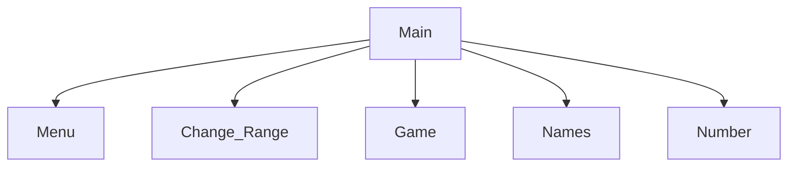

# Number guessing game
Logan, Roman

## Number Guessing game Description
A simple game where two players guess a number

### Number Guessing Game Flowchart

#### Function Diagrams

| `main`    |               |  Roman     |
| ------------------ | ------------- | ------------ |
| `.arguement:none.`    | takes no input  |              |
| `..`     |   | outputs nothing            |
| `..`      | Calls all other functions and runs the game | returns nothing |
***
| `game`    |               |     Game   |
| ------------------ | ------------- | ------------ |
| `argument:none`    | take input for the number guess  |              |
| ``     | calculates how close they are to the random number  | >, <, or if they won the game             |
| ``      | Runs the game having players take turn guessing the random number| returns nothing |
***
| `main`    |               |  Name     |
| ------------------ | ------------- | ------------ |
| `..`    | takes input from the user for ____  |              |
| `..`     | calculates ______  | outputs ____             |
| `..`      | takes input for name ___ | returns total |
***
| `main`    |               |  Name     |
| ------------------ | ------------- | ------------ |
| `..`    | takes input from the user for ____  |              |
| `..`     | calculates ______  | outputs ____             |
| `..`      | takes input for name ___ | returns total |
***
| `main`    |               |  Name     |
| ------------------ | ------------- | ------------ |
| `..`    | takes input from the user for ____  |              |
| `..`     | calculates ______  | outputs ____             |
| `..`      | takes input for name ___ | returns total |
***
